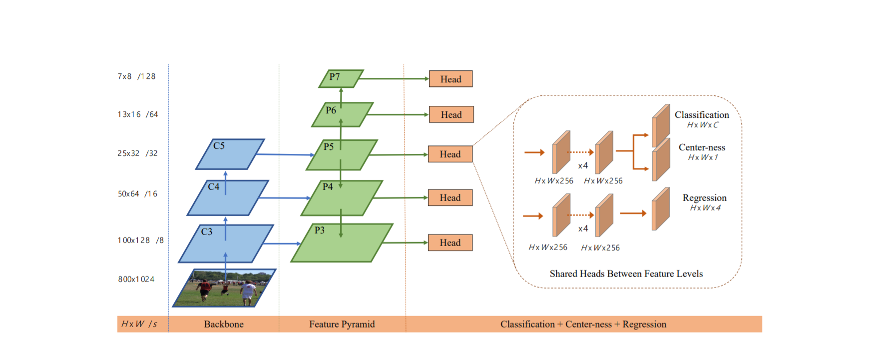
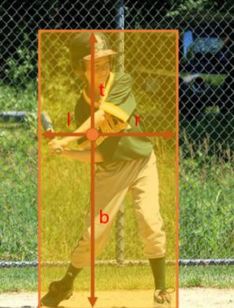
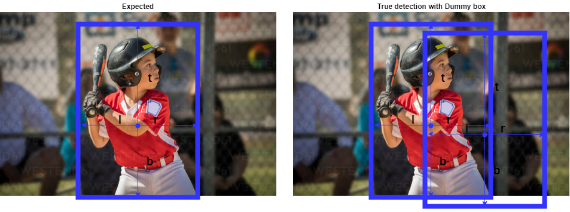

# Fully Convolutional One-Stage Object Detection(FCOS):

* This method do not use anchors , which means there would be no RPN layer, which implies no in between IOU thresholding calculations invovled. So, it's basic structure consists 4 modules:

1. BackBone + FPN

2. Classification Head

3. Centerness Head

4. Regression Head

* **These modules can be visualized as given in the diagram below:**

<p align="center">
  
</p>


* The above diagram may give a rough idea about how it works. Here, a fundamental question gets arised, that is ```if there are no anchors , then how would regression head work?``` 

###  Regression Head:

* Regression head produces offsets l(left),r(right),t(top),b(bottom), these are normalized lengths according to pixel at a point.


<p align="center">
  
</p>

* These offsets are applied on to the input image relative to it's size. Hence the output from regression head would be **H X W X 4**.

### Centerness Head:

* Since the process is anchor free, it's cost is impacted while detection. It would produce a dummy box around a true detection.

* The dummy boxes obtained from the regression head would deviate from the object's center which would lower the quality of the detection.

<p align="center">
  
</p>

* Hence a centerness head is added to the overall pipeline, centerness of the ground truth object is calculated and compared with predicted centerness. Then binary cross entropy loss is applied to that difference which is ready to back propagate.

* So while inferencing, centerness scores of particular bounding box is multiplied with its classification score to get a final predicted score. Hence based on these final scores, dummy boxes would be removed in NMS module at the end.

```bash
Centerness formula: sqrt([min(l,r)/max(l,r)] x [min(t,b)/max(t,b)])
```

### Pros and Cons when compared with MASK-RCNN:

#### Pros:

* Training becomes simpler and less time consuming, since RPN and related calculations are not present.

* Higher recall value on detection.

#### Cons:

* Low precision, which means lower accuracy.

* Detection quality is low when there are overlapping objects.

* **FCOS:** [Paper](https://arxiv.org/pdf/1904.01355.pdf)
